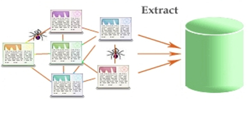
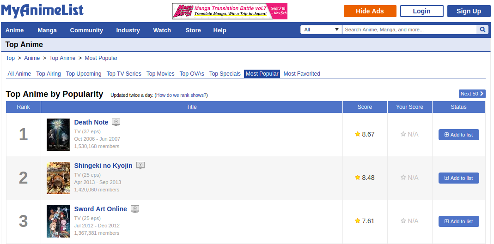
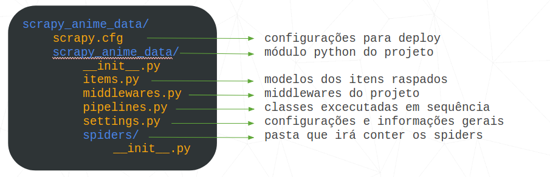
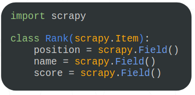
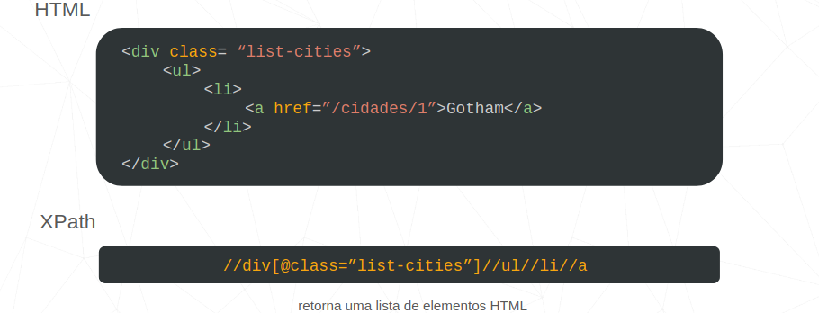
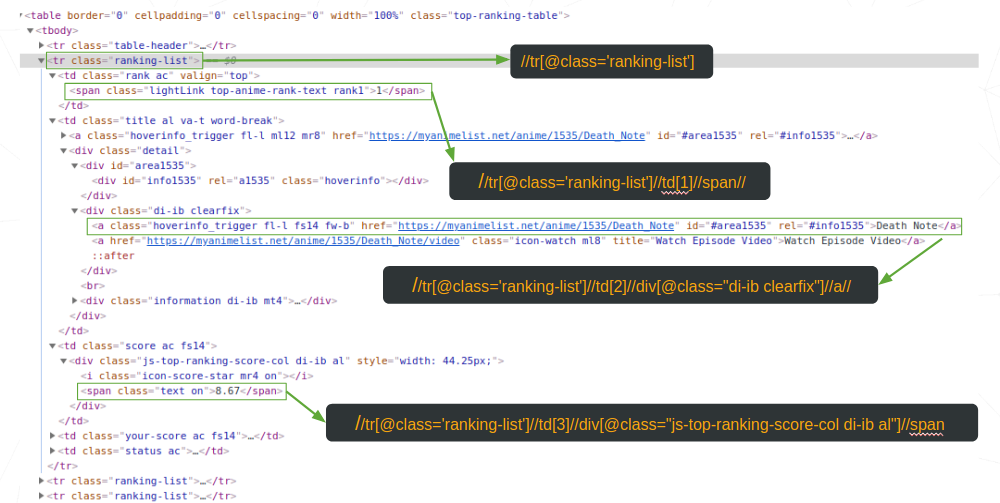
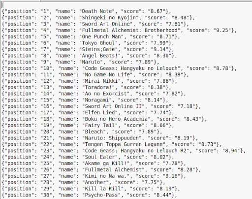

<center>

</center>

<br>
O [Scrapy](https://scrapy.org/) é um framework de código aberto escrito em python para web crawling e web scraping, em que deseja-se extrair dados estruturados de fontes não estruturadas, como páginas web.

# Web Crawling & Web Scraping

Web crawlers são bots, spider bots, que percorrem páginas web indexando-as. Além poderem ser usados para fazer extração de dados dessas páginas, o que é chamado de web scraping.

<center>

</center>

# Introdução

Neste tutorial vamos aprender o funcionamento básico do Scrapy.<br>
Para isso utilizaremos um simples exemplo, que consiste em retirar algumas informações sobre os 50 animes mais populares do site [MyAnimeList](https://myanimelist.net/topanime.php?type=bypopularity) e armazená-las em um arquivo JSON.

<center>

</center>

# Instalando o Scrapy

O Scrapy é compatível com as duas versões do Python. Se você estiver usando o Anaconda ou o Miniconda, poderá instalar o pacote do canal Conda-Forge, que tem pacotes atualizados para Linux, Windows e OS X.

Para instalar o Scrapy usando conda, execute:


```python
conda install -c conda-forge scrapy
```

Caso contrário, se estiver usando Linux ou Mac OS X, execute:


```python
pip install scrapy
```

# Criando um projeto

Primeiramente é necessário configurar um novo projeto Scrapy. Para isso abra o terminal no diretório em que deseja salvar o código e execute:


```python
scrapy startproject scrapy_anime_data
```

Desta forma obtemos a pasta <font color="green">scrapy_anime_data</font> com os seguintes elementos:

<center>

</center>

# Modelo de itens

Para especificar os dados que queremos extrair é necessário definir no arquivo <font color="green">items.py</font> uma classe que irá conter os diferentes dados para cada item extraído. 

<center>

</center>

# Criando spiders

Spiders são classes que definem como um grupo de sites terá seus dados extraídos. Elas necessitam de:

<ul>
    <li> nome; 
    <li> lista de URLs, que a spider irá percorrer inicialmente;
    <li> método <b>parse( )</b>,que analisa cada resposta baixada (páginas), extrai os dados e encontra novas URLs.
</ul>

O arquivo definindo as spiders deve ser criado na pasta <font color="green">spiders/</font>. Para este tutorial criaremos um arquivo vazio chamado <font color="green">anime_data_spider.py</font> dentro da pasta especificada anteriormente.<br>
<br>
No nosso arquivo devemos primeiramente importar algumas funções do scrapy e o nosso modelo de itens:


```python
import scrapy
from scrapy_anime_data.items import Rank
```

Depois é preciso estabelecer o nome da classe de nossa spider, assim como o nome que será usado pelo scrapy para chamá-la e a lista de URLs que iremos iniciar a extração:


```python
class AnimeDataSpider(scrapy.Spider):
    name = "anime_data"
    start_urls = ["https://myanimelist.net/topanime.php?type=bypopularity"]
```

Por fim, dizemos ao scrapy como deve ser analisada cada página web visitada através da função <b>parse()</b>.


```python
def parse(self, response):
```

Nesta função utilizaremos a linguagem [XPath](https://en.wikipedia.org/wiki/XPath) para caminhar pela página HTML retornada pelo parâmetro <i>response</i>.<br>
Para facilitar o entendimento verifique como é feito o caminhamento em XPath no exemplo abaixo:

<center>

</center>

Veja agora como podemos caminhar pela página que iremos extrair os dados:

<center>

</center>

O XPath nos retorna o resultado como uma lista em formato HTML, logo se quisermos o texto contido no retorno é preciso usar a função <b>text()</b> e extrair o resultado da lista. Após a obtenção dos dados requeridos podemos armazená-los no modelo de itens anteriormente criado.<br>
<br>
Por fim, o nosso método <b>parse()</b> ficará como a seguir:


```python
def parse(self, response):
        animes = response.xpath("//tr[@class='ranking-list']")
        for anime in animes:
            rank = Rank()
            rank['position'] = anime.xpath('td[1]//span//text()').extract_first()
            rank['name'] = anime.xpath('td[2]//div[@class="di-ib clearfix"]//a//text()').extract_first()
            rank['score'] = anime.xpath('td[3]//div[@class="js-top-ranking-score-col di-ib al"]//span//text()').extract_first()
            yield rank
```

# Executando o spider

O Scrapy pode armazenar os dados em vários formatos diferentes e iremos utilizar o formato JSON.<br>
Para executar o spider basta abrir o terminal dentro da pasta principal do projeto e efetuar o comando:


```python
scrapy crawl anime_data -o result.json
```

<b>OBS.:</b>
<ul>
    <li><font color="green">anime_data</font> é o nome do spider; 
    <li><font color="green">-o</font> especifica qual o nome do arquivo e formato que será salvo o resultado.
</ul>

Quando o processo de extração terminar o arquivo <font color="green">result.json</font> estará dentro na pasta <font color="green">scrapy_anime_data/scrapy_anime_data/</font> com o resultado a seguir:

<center>

</center>

# Considerações

Com o Scrapy ainda é possível:
<ul>
    <li> Persistir o resultado em um banco de dados;
    <li> Rodar o spider periodicamente com o Scrapy Cloud.
</ul>

Código disponível em: https://github.com/BravoNatalie/Tutorial_Scrapy 

# Referências

Disponível em: https://docs.scrapy.org/en/latest/intro/tutorial.html acessado em 3 de Outubro de 2018.<br>
Disponível em: https://www.youtube.com/watch?v=rj8Sqsgh5TM&t=168s acessado em 4 de Outubro de 2018.<br>
Disponível em: https://www.youtube.com/watch?v=DRfEY-qzyvk&t=311s acessado em 4 de Outubro de 2018.<br>
Disponível em: https://doc.scrapy.org/en/xpath-tutorial/topics/xpath-tutorial.html acessado em 5 de Outubro de 2018.<br>
Disponível em: https://stair.wm.edu/Webscraping2_scrapy.html acessado em 6 de Outubro de 2018.
